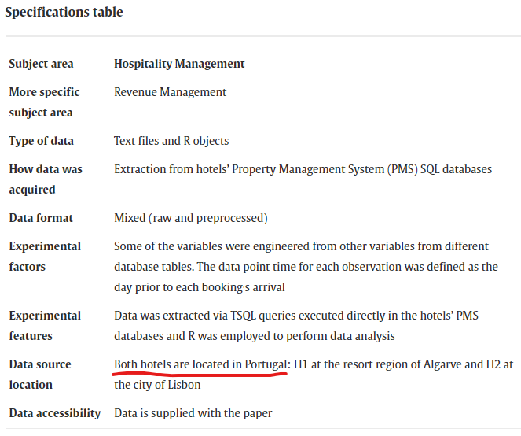
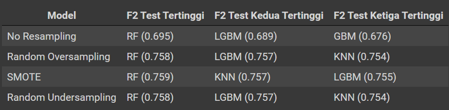
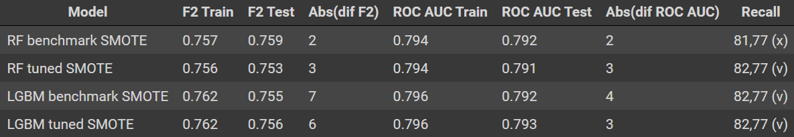
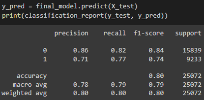
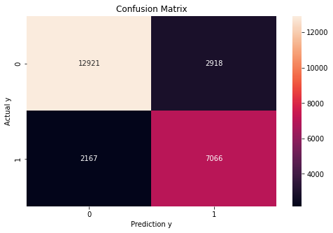
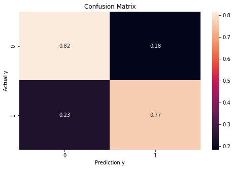
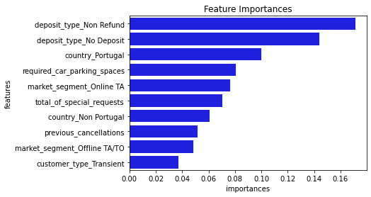
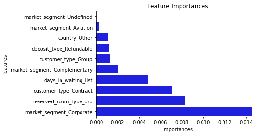

# Model-HotelBookingDemand

Capstone 3 Purwadhika DS
by Herdiansyah Prihatna Putra

# Introduction

Hospitality industry, salah satunya hotel, umumnya menggunakan strategi overbooking untuk mengatasi masalah booking cancellation. Hal ini juga didukung oleh perkembangan teknologi dalam kasus pemesanan online, sehingga memudahkan seseorang untuk memesan ataupun melakukan pembatalan pesanan (booking cancellation).

Booking cancellation memiliki dampak yang cukup signifikan terhadap hospitality industry karena dapat memaksimalkan revenue, tetapi di sisi lain dapat memberikan dampak negatif kepada reputasi hotel jika benar-benar terjadi overbooking. Oleh karena itu, apabila hotel dapat melakukan prediksi terhadap case booking cancellation, pebisnis industri perhotelan dapat mengoptimalkan strategi overbooking dan meminimalkan risiko.

# Business Problem

Strategi overbooking akan berjalan dengan baik apabila kita dapat mengetahui jumlah booking yang akan dicancel oleh pelanggan dengan tepat. 
- Prediksi cancel terlalu banyak, maka lebih banyak kamar yang tidak tersewa (more empty rooms). 
- Prediksi cancel terlalu sedikit, maka kemungkinan besar terjadi overbook pelanggan akan tidak merasa puas karena tidak mendapatkan kamar.

# Data Understanding

| Attribute | Data Type | Description |
| --- | --- | --- |
| country | Object (Text) | Country of origin. Categories are represented in the ISO 3155–3:2013 format. |
| market_segment | Object (Text) | Market segment designation. In categories, the term “TA” means “Travel Agents” and “TO” means “Tour Operators”. |
| previous_cancellations | Integer (Number) | Number of previous bookings that were cancelled by the customer prior to the current booking. |
| booking_changes | Integer (Number) | Number of changes/amendments made to the booking from the moment the booking was entered on the PMS until the moment of check-in or cancellation. |
| deposit_type | Object (Text) | Indication on if the customer made a deposit to guarantee the booking. This variable can assume three categories: No Deposit – no deposit was made; Non Refund – a deposit was made in the value of the total stay cost; Refundable – a deposit was made with a value under the total cost of stay. |
| days_in_waiting_list | Integer (Number) | Number of days the booking was in the waiting list before it was confirmed to the customer. |
| customer_type | Object (Text) | Type of booking, assuming one of four categories: Contract - when the booking has an allotment or other type of contract associated to it; Group – when the booking is associated to a group; Transient – when the booking is not part of a group or contract, and is not associated to other transient booking; Transient-party – when the booking is transient, but is associated to at least other transient booking. |
| reserved_room_type | Object (Text) | Code of room type reserved. Code is presented instead of designation for anonymity reasons. |
| required_car_parking_spaces | Integer (Number) | Number of car parking spaces required by the customer. |
| total_of_special_requests | Integer (Number) | Number of special requests made by the customer (e.g. twin bed or high floor). |
| is_canceled | Integer (Number) | Value indicating if the booking was canceled (1) or not (0). |

Note: 
- Terdapat null value di kolom country
- Kolom target 'is_canceled' memiliki kecenderungan imbalance

# Preprocessing
Sumber dataset Kaggle : https://www.kaggle.com/datasets/jessemostipak/hotel-booking-demand

 

Referensi : https://www.sciencedirect.com/science/article/pii/S2352340918315191

Feature Engineering
- Kolom 'country' null value akan diisi dengan Other. Kemudian 'county' akan diklasifikasikan menjadi 3 yaitu 'Portugal', 'Non Portugal', 'Other'

Encoding
- One Hot Encoding : 'country', 'market_segment', 'deposit_type', 'customer_type'
- Ordinal Encoding : 'reserved_room_type
- Tanpa Encoding (Kolom Numerikal) : 'previous_cancellations', 'booking_changes', 'days_in_waiting_list', 'required_car_parking_spaces', 'total_of_special_requests'

Scaling

Scaling hanya dilakukan untuk model KNN karena perhitungan model berdasarkan distance, scaler yang digunakan adalah RobustScaler

# Resampling
- Random Oversampling
- SMOTE
- Random Undersampling

# Benchmark Model

# Hyperparameter Tuning

# Final Model

Final Model : Random Forest Tuned, Resampling SMOTE

# Feature Importances

Top 10 Feature Importance

Bottom 10 Feature Importance

# Implementasi Model

**Business Calculation**

Jika terdapat 200 booking kemudian kita tidak memiliki model untuk prediksi. Berikut asumsi perhitungan yang akan digunakan:
- Prediksi book (no cancel), aktual book (no cancel) = + 100 USD (kamar tersewa)
- Prediksi book (no cancel), aktual cancel = - 50 USD (kamar tidak tersewa) 
- Prediksi cancel, aktual book (no cancel) = - 75 USD (overbooked) 
- Prediksi cancel, aktual cancel = + 100 USD (diasumsikan bila prediksi cancel dan aktual cancel, hotel dapat mencari pengganti penyewa kamar hotel)

Maka terdapat dua kondisi asumsi yang paling buruk dan paling ideal. 

Kondisi pertama yaitu kondisi paling buruk, saat dari 200 booking, kita mengasumsikan kondisi prediksi yang balance yaitu prediksi 100 cancel dan 100 book (no cancel) sedangkan kondisi aktual adalah 200 no cancel

| | Prediksi Book | Prediksi Cancel |
|---|---|---|
|Aktual Book | 100 x 100 USD | 100 x (75 USD) |
|Aktual Cancel | 0 x (50 USD) | 0 x 100 USD |
Catatan = Tanda kurung () berarti negatif

Maka dalam kondisi terburuk kita akan mendapatkan income = (100 x 100 USD) - (100 x 75 USD) = 2.500 USD

Kondisi kedua yaitu kondisi paling ideal, saat dari 200 booking, kita mengasumsikan kondisi prediksi yang balance yaitu prediksi 100 cancel dan 100 book (no cancel) sedangkan kondisi aktual yang terjadi juga sama yaitu 100 cancel dan 100 book (no cancel)

| | Prediksi Book | Prediksi Cancel|
|---|---|---|
|Aktual Book | 100 x 100 USD | 0 x (75 USD) |
|Aktual Cancel | 0 x (50 USD) | 100 x 100 USD |
Catatan = Tanda kurung () berarti negatif

Maka dalam kondisi ideal kita akan mendapatkan income = (100 x 100 USD) + (100 x 100 USD) = 20.000 USD

Dengan **model** yang kita buat tentunya kita ingin mendapatkan income yang paling mendekati kondisi ideal. Berikut merupakan perhitungan yang didapatkan berdasarkan model yang dibuat.

| | Prediksi Book | Prediksi Cancel|
|---|---|---|
|Aktual Book | 82 x 100 USD | 18 x (75 USD) |
|Aktual Cancel | 23 x (50 USD) | 77 x 100 USD |
Catatan = Tanda kurung () berarti negatif

Maka berdasarkan estimasi mode, kita akan mendapatkan income = (82 x 100 USD) - (18 x 75 USD) - (23 x 50 USD) + (77 x 100 USD) = 13.400 USD

**Case Sensitivity:**

  - Jumlah recall sama tetapi lebih tinggi porsi recall 0 (no cancel/book). Jumlah recall klasifikasi 0 dan 1 = 82 + 77 = 159. Kita coba 83 no cancel, 76 cancel (83 + 76 = 159). Kita akan mendapatkan income = (83 x 100 USD) - (17 x 75 USD) - (22 x 50 USD) + (76 x 100 USD) = 13.525 USD

  - Kita ambil case paling ekstrim dengan recall jumlah recall sama yaitu 159 dengan komposisi recall klasifikasi 0 (no cancel) = 100 dan recall klasifikasi 1 (cancel) = 59. Kita akan mendapatkan income = (100 x 100 USD) - (0 x 75 USD) - (41 x 50 USD) + (59 x 100 USD) = 13.850 USD

  Sehingga apabila ada evaluation metric recall dengan jumlah yang sama, maka komposisi recall klasifikasi 0 (no cancel) akan membuat kita mendapatkan income lebih banyak. Hal ini juga agak kontradiktif dengan tujuan dibuat model yaitu untuk mendeteksi atau memprediksi cancel booking dengan benar. Hal ini bisa menjadi salah satu bukti pada riset awal yang mengatakan biasanya biaya kamar kosong akan lebih besar dibandingkan dengan overbook karena selaras dengan tujuan dibuat model yaitu memprediksi cancel booking.
  
# Kesimpulan

Model yang digunakan adalah RF Tuned SMOTE dengan parameter RF berikut.

RandomForestClassifier( random_state=0, class_weight='balanced_subsample', criterion='entropy', max_depth=10, min_samples_split=2, n_estimators=120)

 

Berikut merupakan kesimpulan dari model Random Forest Tuned dengan resampling SMOTE.

- Precision = 0.71, berarti model dapat memprediksi booking yang akan dicancel secara benar dengan persentase 71%.
- Recall = 0.77, berarti model dapat memprediksi 77 cancelled booking dari aktual 100 cancelled booking .
- False Positive Rate (Aktual cancel, Prediksi tidak cancel) = 18%
- False Negative Rate (Aktual tidak cancel, Prediksi cancel) = 23%
- Model Limitation = Interpretabilitas ensemble method mungkin akan lebih rendah walaupun menghasilkan prediksi yang relatif baik. Waktu komputasi untuk case hyperparameter tuning masih terlalu lama dan hanya menghasilkan sedikit peningkatan performa model (bisa diatasi dengan randomize search atau mengurangi parameter yang akan dicoba)

Catatan: Untuk kasus dataset yang memiliki target cenderung imbalance, sebaiknya memerhatikan kondisi stratify pada train test split dan proses cross validation. Serta sebaiknya tidak menggunakan metric akurasi untuk menilai performa model karena dapat menghasilkan bias.

# Rekomendasi

Rekomendasi yang dapat meningkatkan performa model ataupun eksplorasi project lebih jauh:
- Collect more good data. 

  Terutama untuk kasus target imbalance, jika memungkinkan akan lebih baik kalau data canceled booking lebih seimbang dengan data no cancelled booking
- Add new feature that might related to canceled booking. 
  
  Jika kita melihat sumber dataset public dari Kaggle, terdapat beberapa fitur lainnya yang tidak terdapat pada dataset yang digunakan seperti Average Daily Rate (ADR), number of days between booking and arrival, atau jika ingin melakukan prediksi time history bisa menggunakan fitur tanggal yang tercantum di public dataset kaggle

- Try another combination of feature selection, feature engineering, resampling and different algorithm.

  Feature selection bisa dicoba menggunakan misal RFE
  Feature engineering tidak hanya di kolom country
  Resampling bisa dicoba menggunakan ADASYN dan beberapa turunan dari SMOTE
  Model bisa dicoba menggunakan Naive Bayes, CatBoost, dll 

- Business calculation need to be improved.

  Perhitungan case bisnis perlu mencari lebih detail terkait perbandingan cost kamar yang tidak tersewa dengan kasus overbooking. Karena jika kita membuat model dengan tujuan memprediksi cancelled book ternyata lebih selaras jika mem-punish kasus kamar tidak tersewa (kamar kosong) dibanding kasus overbook atau dengan kata lain kerugian yang terjadi akibat kamar tidak tersewa lebih besar dibandingkan kasus overbook.
